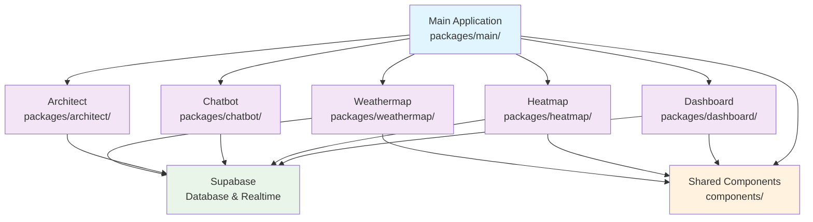
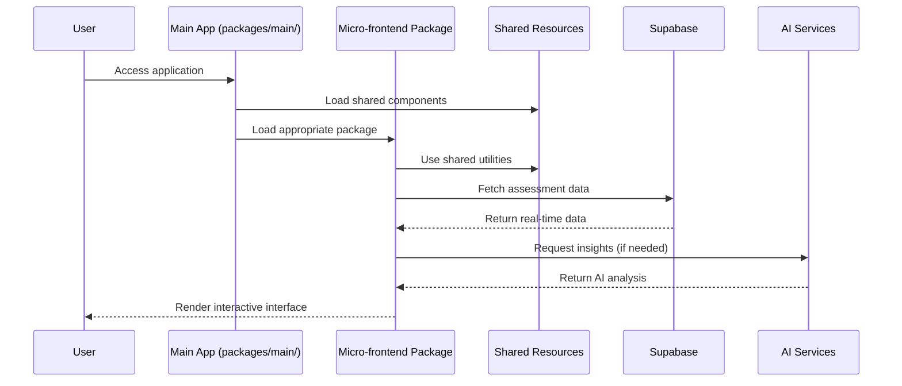

# Enterprise Transformation Platform - Architecture Documentation

## Overview

The Enterprise Transformation Platform is a monorepo-based application designed for business leaders to assess organizational maturity and digital transformation progress. The platform provides real-time metrics, visual assessments, AI-powered consulting, and educational frameworks through a modular architecture organized in a monorepo structure.

## Monorepo Structure

```
/workspaces/twintech/
├── packages/
│   ├── main/                 # Main orchestrator application
│   ├── dashboard/           # Real-time metrics and KPIs
│   ├── heatmap/            # Visual capability assessment
│   ├── chatbot/            # AI-powered consulting
│   ├── architect/          # Learning management system
│   ├── weathermap/         # Weather overlay heatmaps
│   └── ...                 # Additional packages
├── components/             # Shared React components
├── data/                  # Shared data structures
├── hooks/                 # Shared React hooks
└── docs/                  # Documentation
```

## System Purpose

**Primary Goal**: Enable business leaders to assess and track enterprise transformation maturity
**Target Users**: Business leaders, transformation consultants, organizational change managers
**Key Value**: Real-time insights, visual capability mapping, AI-driven recommendations, and structured learning

## Technical Architecture

### Technology Stack

- **Frontend Framework**: React 18+ with TypeScript
- **Build Tool**: Vite for fast development and optimized builds
- **Backend Services**: Supabase (PostgreSQL database + realtime subscriptions)
- **Deployment**: Vercel/Netlify for frontend deployment
- **Monorepo Management**: Package.json workspaces or similar
- **Styling**: CSS Modules / Component libraries
- **State Management**: React Context + Custom hooks

### Architecture Overview



## Package Details

### 1. Main Application (`packages/main/`)
**Role**: Central orchestrator and entry point for the monorepo
**Responsibilities**:
- Micro-frontend coordination and routing
- User authentication and session management
- Shared component consumption
- Navigation and layout management

**Key Components**:
- `App.tsx` - Main application wrapper
- Navigation components (`Header.tsx`, `Navbar.tsx`)
- Authentication context (`AuthContext.tsx`)
- Route protection (`ProtectedRoute.tsx`)

### 2. Dashboard Package (`packages/dashboard/`)
**Role**: Real-time transformation metrics and KPIs
**Responsibilities**:
- Display real-time organizational metrics
- Transformation health monitoring
- Strategic insights visualization
- Dimension-based analysis

**Key Components**:
- `TransformationHealth.tsx` - Overall transformation status
- `StrategicInsights.tsx` - Business intelligence dashboards
- `DimensionModule.tsx` - Multi-dimensional analysis
- `SectorOutcomes.tsx` - Business sector performance

### 3. Heatmap Package (`packages/heatmap/`)
**Role**: Visual capability assessment and maturity mapping
**Responsibilities**:
- Interactive capability heatmaps
- Maturity level visualization
- Spider charts for multi-dimensional analysis
- Assessment data collection and display

**Key Components**:
- `CapabilityHeatmap.tsx` - Main heatmap visualization
- `HeatmapGrid.tsx` - Grid layout and interactions
- `SpiderChart.tsx` - Radial capability charts
- `AttributeListContent.tsx` - Assessment attribute management

### 4. Chatbot Package (`packages/chatbot/`)
**Role**: AI-powered consulting and interactive guidance
**Responsibilities**:
- Natural language interaction
- AI-driven recommendations
- Context-aware guidance
- Integration with assessment data

**Key Components**:
- `ChatView.tsx` - Main chat interface
- `ChatInput.tsx` - User input handling
- `ChatMessage.tsx` - Message rendering
- AI service integration (`aiService.ts`)

### 5. Architect Package (`packages/architect/`)
**Role**: Learning management system for transformation frameworks
**Responsibilities**:
- Educational content delivery
- Course and lesson management
- Framework documentation
- Progress tracking

**Key Components**:
- `LessonContent.tsx` - Content rendering and navigation
- Course management hooks (`useCourse.ts`)
- Markdown content processing
- Progress tracking system

### 6. Weathermap Package (`packages/weathermap/`)
**Role**: Advanced capability heatmap visualization with weather overlays
**Responsibilities**:
- Interactive capability heatmaps with weather pattern overlays
- Real-time data fetching from Supabase
- Multiple visualization modes (list vs chart)
- Customizable overlay configurations

**Key Components**:
- `CapabilityHeatmapContainer.tsx` - Main heatmap orchestration
- `WeatherHeatmapOverlay.tsx` - Weather pattern visualization
- `HeatmapGrid.tsx` - Grid layout and interactions
- `SpiderChart.tsx` - Radial capability analysis
- Data services for Supabase integration

## Shared Resources

### Shared Components (`components/`)
- Reusable React components across packages
- Consistent design system implementation
- TypeScript interfaces and types
- Common utility functions

### Shared Hooks (`hooks/`)
- Custom React hooks for common functionality
- State management utilities
- API interaction patterns
- Authentication helpers

### Shared Data (`data/`)
- Type definitions and interfaces
- Constants and configuration
- Mock data for development
- Schema definitions

## Development Port Configuration

Each package runs on a specific port during local development with host mode enabled:

- **Main Application** ([`packages/main/`](packages/main/vite.config.ts:9)): **Port 5170** with host mode
- **Dashboard** ([`packages/dashboard/`](packages/dashboard/vite.config.ts:9)): **Port 5174** with host mode
- **Chatbot** ([`packages/chatbot/`](packages/chatbot/vite.config.ts:9)): **Port 5176** with host mode
- **Heatmap** ([`packages/heatmap/`](packages/heatmap/vite.config.ts:9)): **Port 5175** with host mode
- **Architect** ([`packages/architect/`](packages/architect/vite.config.ts:9)): **Port 5173** with host mode
- **Weathermap** ([`packages/weathermap/`](packages/weathermap/vite.config.ts:9)): **Port 5177** with host mode

## Monorepo Development Workflow

### Development Setup
```bash
# Install dependencies across all packages
npm install

# Develop specific packages on their assigned ports with host mode
cd packages/main        # Runs on port 5170 with --host
npm run dev -- --host

cd packages/dashboard   # Runs on port 5174 with --host
npm run dev -- --host

cd packages/chatbot     # Runs on port 5176 with --host
npm run dev -- --host

cd packages/heatmap     # Runs on port 5175 with --host
npm run dev -- --host

cd packages/architect   # Runs on port 5173 with --host
npm run dev -- --host

cd packages/weathermap  # Runs on port 5177 with --host
npm run dev -- --host

# For silent operation or timeout configurations, update package.json scripts
# Example: "dev": "vite --host --silent"
```

### Build Process
- Independent build configurations per package
- Shared dependency management
- Consistent TypeScript configuration
- Optimized bundle output per package

### Dependency Management
- Shared dependencies in root package.json
- Package-specific dependencies in individual package.json files
- Version consistency across packages
- Peer dependency management

## Data Flow Architecture



## Integration Patterns

### 1. Package Communication
- Main app orchestrates package loading
- Shared state through React Context
- Event-based communication between packages
- Consistent authentication across packages

### 2. Data Integration
- Supabase provides unified data layer
- Real-time subscriptions for live updates
- Shared database schema across packages
- Consistent data access patterns

### 3. Shared Resource Usage
- Components imported from shared directory
- Hooks consumed across packages
- Type definitions shared globally
- Utility functions reused

## Deployment Architecture

### Monorepo Deployment Strategy
- **Independent Deployment**: Each package deploys separately
- **Shared Resources**: Built and included in each package
- **CDN**: Global content delivery for each micro-frontend
- **CI/CD**: Automated builds per package or coordinated deployment

### Backend Services
- **Database**: Supabase PostgreSQL
- **Realtime**: Supabase Realtime subscriptions
- **Storage**: Supabase Storage for assets
- **Auth**: Supabase Authentication

## Development Best Practices

### Code Organization
- Clear package boundaries and responsibilities
- Minimal inter-package dependencies
- Shared resources for common functionality
- Consistent naming conventions

### Testing Strategy
- Unit tests per package
- Integration tests for cross-package functionality
- End-to-end tests for user workflows
- Shared testing utilities

### Version Management
- Coordinated version releases
- Semantic versioning across packages
- Changelog maintenance
- Dependency update coordination

## Monitoring & Analytics

### Application Monitoring
- Error tracking and reporting per package
- Performance metrics collection
- User behavior analytics
- Real-time health checks

### Business Analytics
- Transformation metric tracking
- User engagement metrics
- Assessment completion rates
- ROI measurement capabilities

## Future Architecture Considerations

### Monorepo Enhancements
- Advanced monorepo tooling (Turborepo, Nx)
- Improved build caching
- Better dependency visualization
- Enhanced developer experience

### Technical Evolution
- Mobile application development
- Offline capability assessment
- Advanced AI/ML integration
- Internationalization support

---

*Architecture documented on: 2025-08-24*
*Version: 1.0.0*
*Monorepo Structure: Confirmed*