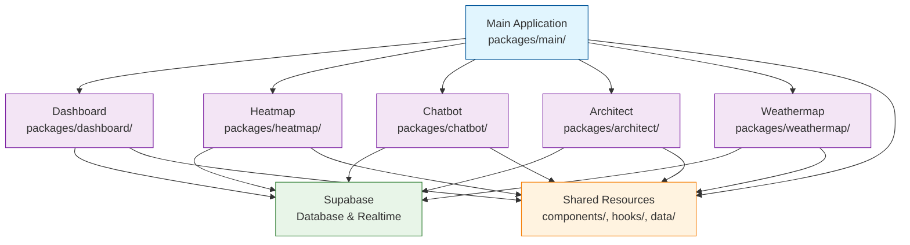
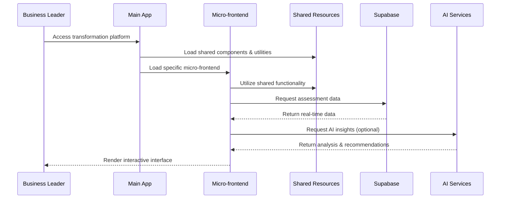
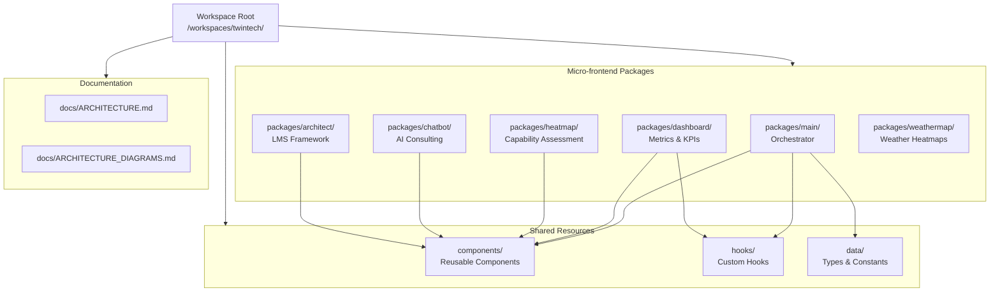
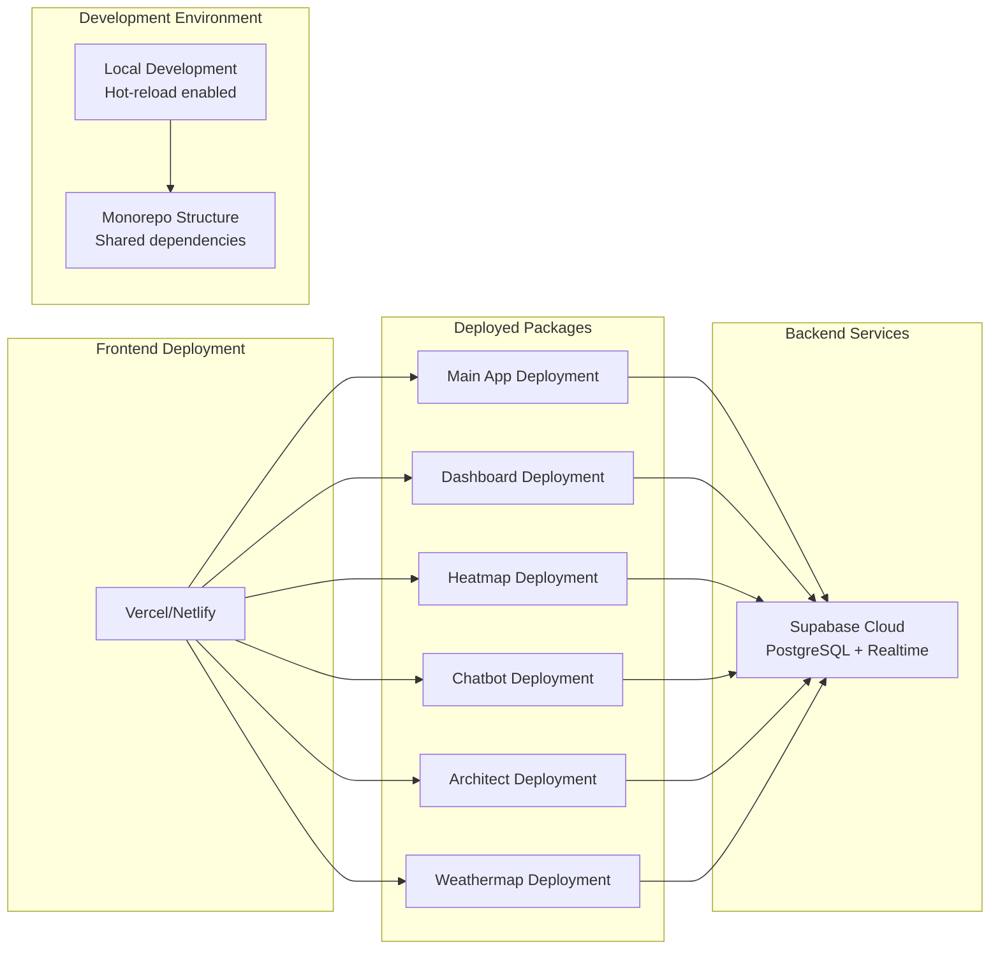
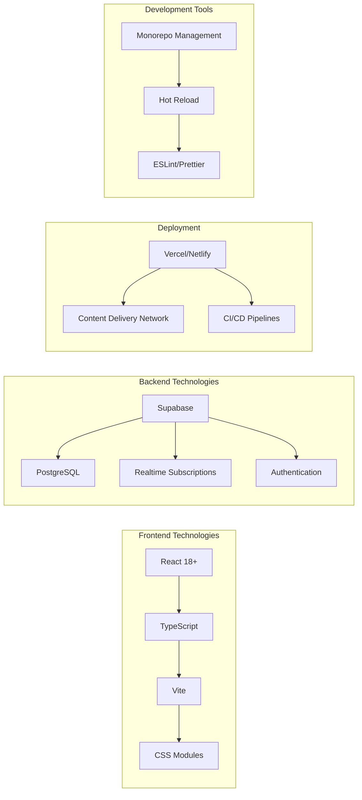
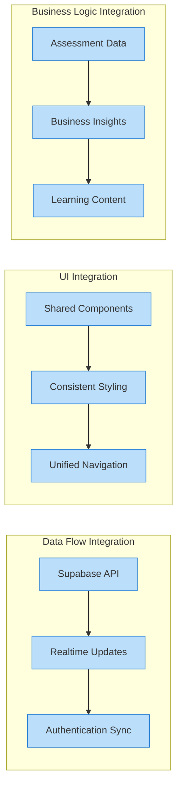

# Architecture Diagrams

## System Overview

## Data Flow Sequence

## Monorepo Structure

## Deployment Architecture

## Technology Stack

## Key Integration Points

## Legend

- **Main Application**: Central orchestrator (blue)
- **Micro-frontend Packages**: Specialized functionality (purple)
- **Backend Services**: Data storage and realtime (green)
- **Shared Resources**: Reusable code across packages (orange)
- **Integration Points**: Connection and data flow points (light blue)

---

*Diagrams created: 2025-08-24*
*Use these diagrams in conjunction with ARCHITECTURE.md*